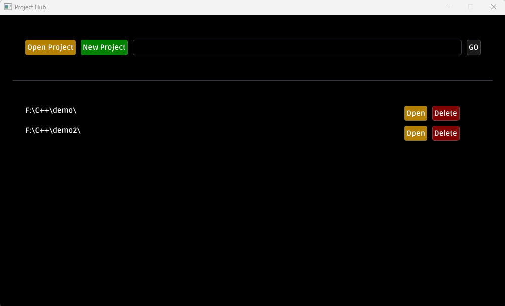
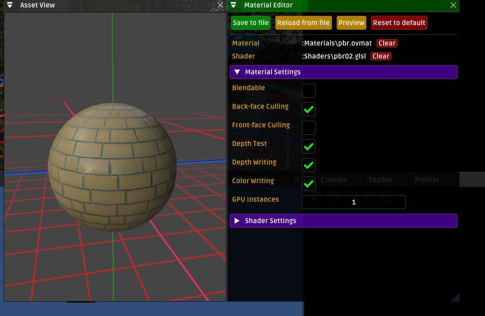
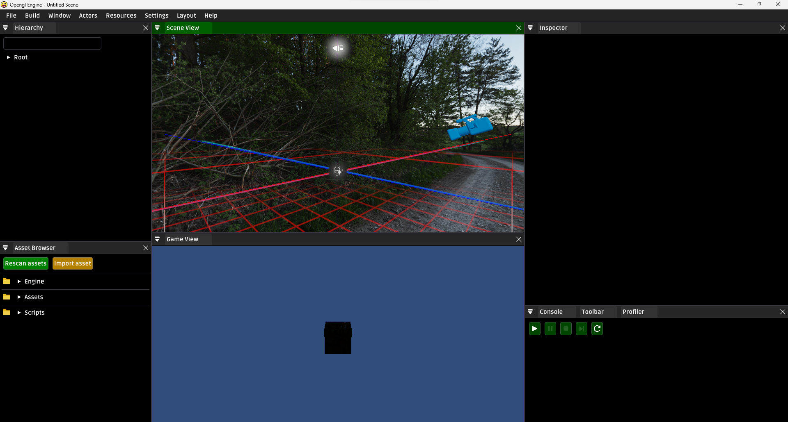
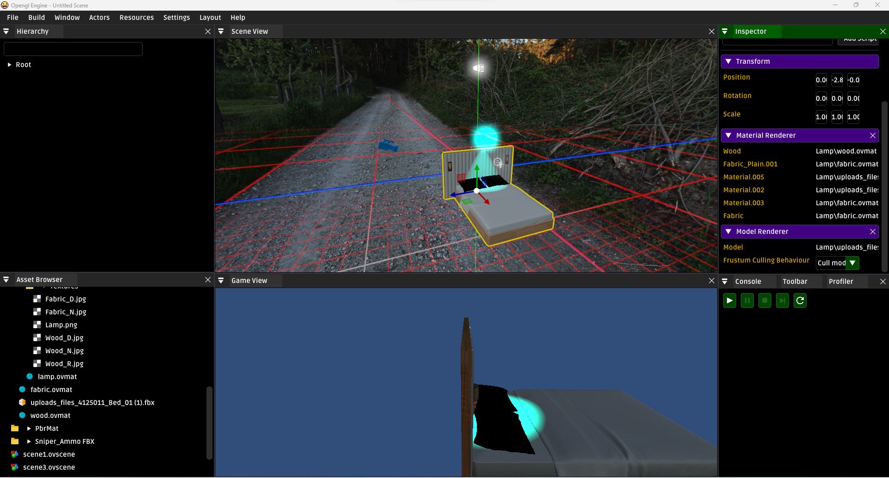
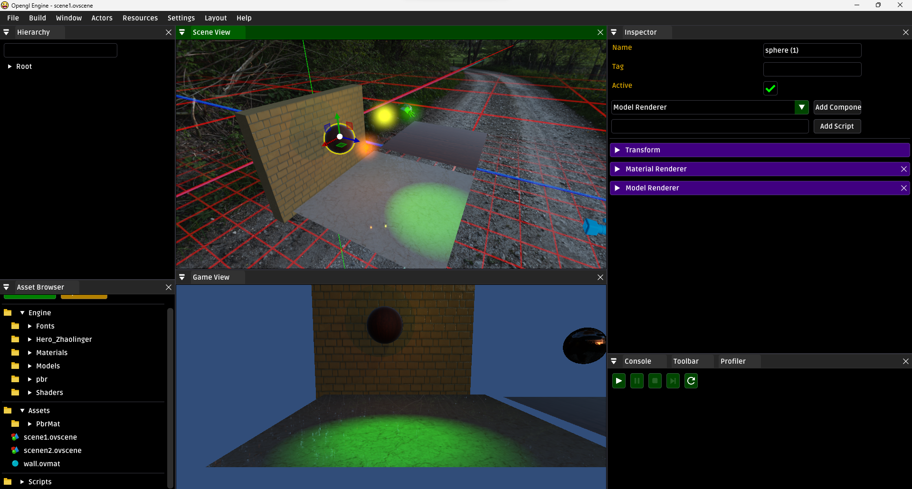
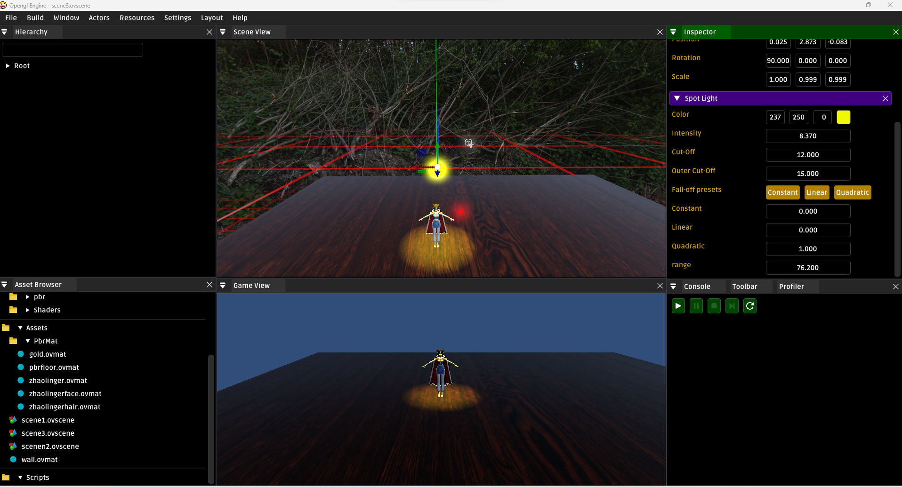
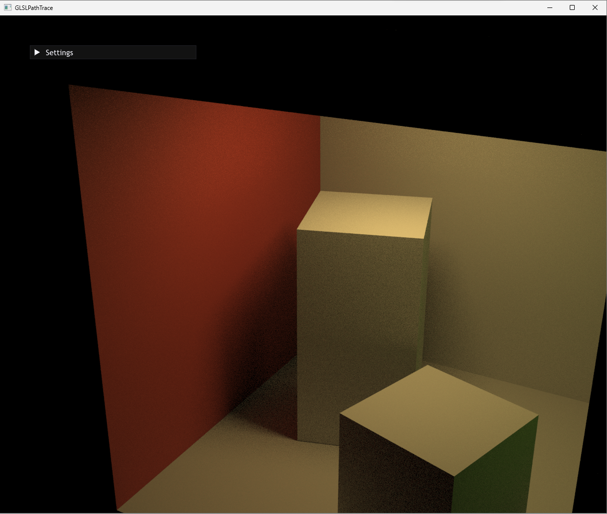
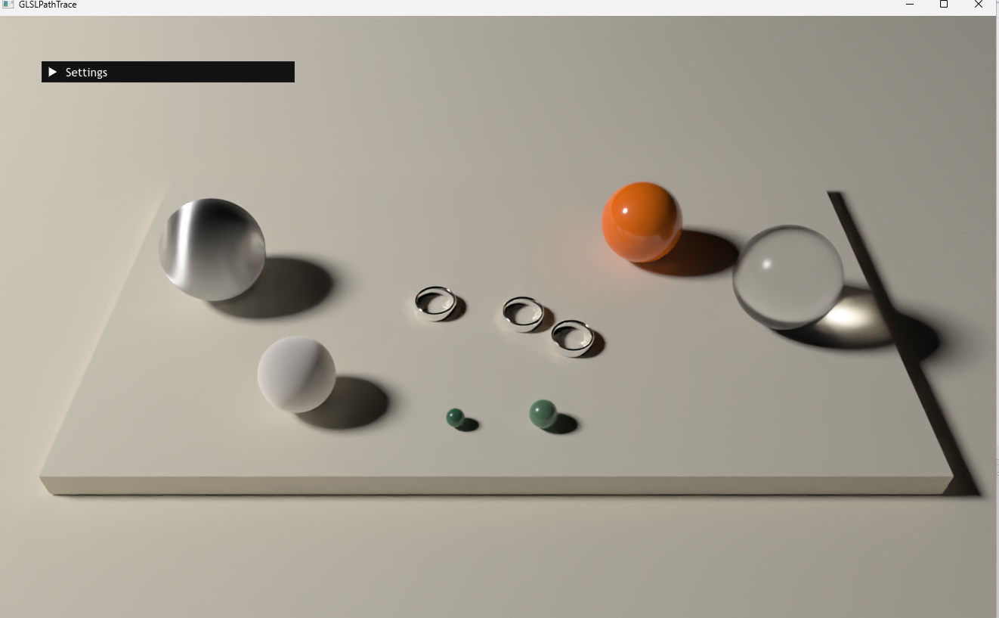
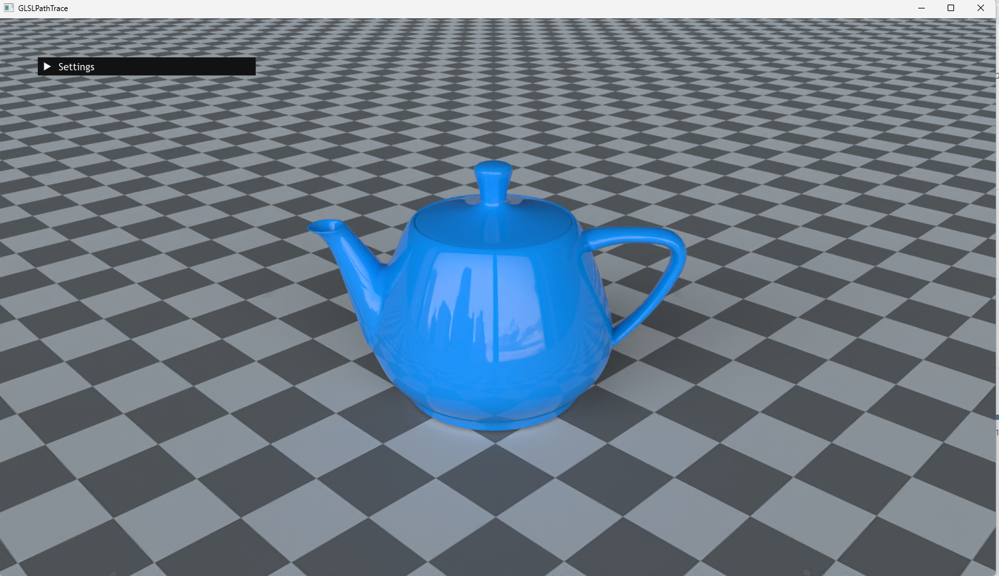

# 3D Graphic

这是一个我在3D图形学习中实践编写的代码的仓库，里面记录我学习3D图形的各种历程

# How to Build(Windows only)

```
git clone https://github.com/271812697/LearnGL_UI.git
cd LearnGL_UI/
mkdir Build
cd Build/
cmake ..
```

# Screenshots




















